# AI Task Manager

<p align="center">
  
</p>

<h3 align="center">Smart task management with AI automation, JWT security, admin controls, and blockchain-inspired audit logging.</h3>

<p align="center">
  
  
  
  
  
  
</p>

## Table of Contents

- [Overview](#overview)
- [Live Demo](#live-demo)
- [Tech Stack](#tech-stack)
- [Features](#features)
- [AI Features](#ai-features)
- [AI Workflow](#ai-workflow)
- [Security](#security)
- [Blockchain Audit Trail](#blockchain-audit-trail)
- [Architecture](#architecture)
- [Architecture Overview](#architecture-overview)
- [Database Design](#database-design)
- [Database Schema](#database-schema)
- [Setup Instructions](#setup-instructions)
- [API Endpoints](#api-endpoints)
- [Screenshots](#screenshots)
- [Future Enhancements](#future-enhancements)
- [Author](#author)

## Overview

AI Task Manager is a smart task management system that combines traditional task planning, AI-powered automation, role-based access control, admin management, and blockchain-inspired task audit logging.

The application helps users register, log in, manage tasks, track task status, view dashboard statistics, update profile details, change passwords, generate AI-powered task details, review AI productivity summaries, receive smart task suggestions, access role-based features, and inspect a verifiable task audit trail.

## Live Demo

| Service | URL |
| --- | --- |
| Frontend | [https://ai-task-manager-sable.vercel.app](https://ai-task-manager-sable.vercel.app/) |
| Backend | [https://ai-task-manager-2jrh.onrender.com](https://ai-task-manager-2jrh.onrender.com) |
| Swagger | [https://ai-task-manager-2jrh.onrender.com/swagger-ui/index.html](https://ai-task-manager-2jrh.onrender.com/swagger-ui/index.html) |

## Tech Stack

| Layer | Technology |
| --- | --- |
| Backend | Java 21, Spring Boot 3.5.15 |
| Security | Spring Security, JWT, BCrypt, Stateless Sessions |
| Persistence | Spring Data JPA, Hibernate, MySQL |
| AI Integration | Spring AI 1.0.1, OpenRouter / OpenAI-compatible models |
| API Docs | Swagger OpenAPI |
| Build Tool | Maven |
| Utilities | Lombok |
| Frontend | React, Vite, Tailwind CSS, Axios, Recharts |

## Features

### User Features

- User registration and login
- JWT-based authentication
- Create, update, delete, and view tasks
- Change task status
- Dashboard statistics
- Profile management
- Password change
- AI task generation, summaries, and suggestions

### Admin Features

- View all users
- View user details
- Delete users
- Manage user roles
- View all tasks
- Analytics dashboard
- Blockchain audit trail

## AI Features

### 1. AI Task Description Generator

Generates a complete task plan from a simple title.

| Input | Output |
| --- | --- |
| Task title | Task description |
|  | Suggested priority |
|  | Estimated completion effort |

Example:

```text
Input:
Prepare client presentation

Output:
Description: Create a professional presentation covering project progress and client requirements.
Priority: HIGH
Estimated Effort: 6 Hours
```

### 2. AI Task Summarizer

Creates productivity summaries from a user's task list.

- Daily productivity summary
- Completed task statistics
- Pending task insights
- AI-generated progress summary

Example:

```text
Total Tasks: 12
Completed: 5
Pending: 7
AI Generated Summary
```

### 3. AI Smart Suggestions

Analyzes workload and recommends practical next actions.

- Priority recommendations
- Duplicate task detection
- Due-date risk alerts

Example:

```text
Focus on HIGH priority tasks first.
No duplicate tasks detected.
2 tasks are approaching their deadlines.
```

## AI Workflow

1. User enters a task title.
2. Frontend sends the request to the AI API.
3. Spring AI sends a structured prompt to OpenRouter through the OpenAI-compatible chat model.
4. AI returns generated task details:
   - Description
   - Priority
   - Estimated effort
   - Due date
5. User can save the generated task into the task manager.

Additional AI features:

- Productivity summary
- Smart suggestions
- Duplicate task detection
- Due-date risk alerts

## Security

AI Task Manager uses Spring Security with stateless JWT authentication to secure user and admin workflows.

| Security Capability | Implementation |
| --- | --- |
| Authentication | JWT access tokens |
| Password Protection | BCrypt password encryption |
| Authorization | Role-based access for USER and ADMIN |
| Session Strategy | Stateless Spring Security configuration |
| Request Validation | JWT request filter |
| Logout Support | Token blacklisting |
| Protected APIs | Role-aware controller access |

## Blockchain Audit Trail

The project includes a lightweight blockchain-inspired audit trail for task operations. Every important task action creates a new block linked to the previous block hash.

Recorded actions:

- `TASK_CREATED`
- `TASK_UPDATED`
- `STATUS_CHANGED`
- `TASK_DELETED`

Each audit block stores:

| Field | Description |
| --- | --- |
| `taskId` | Related task identifier |
| `action` | Task event name |
| `previousHash` | Hash of the previous audit block |
| `currentHash` | Hash generated for the current block |
| `createdAt` | Block creation timestamp |

Purpose:

- Immutable task history
- Audit tracking
- Change verification
- Tamper detection

## Architecture

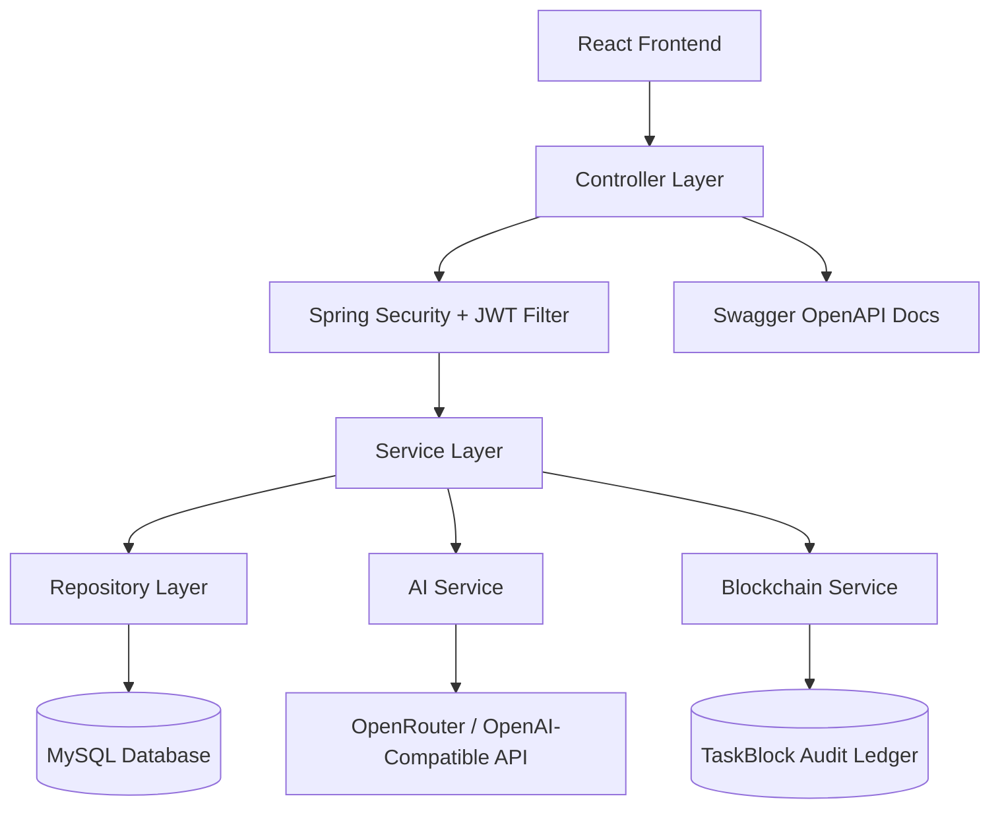

### Layered Flow

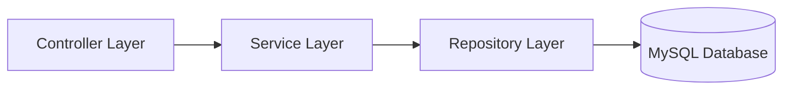

Additional components:

- Spring Security
- JWT filter
- AI service
- Blockchain service
- OpenRouter integration
- Swagger OpenAPI

## Architecture Overview

```text
Frontend (React + Vite)
        |
Axios API Calls
        |
Spring Boot REST APIs
        |
Service Layer
        |
JPA/Hibernate
        |
MySQL Database
```

Additional services:

- JWT Security
- Spring AI Integration
- Blockchain Audit Service

## Database Design

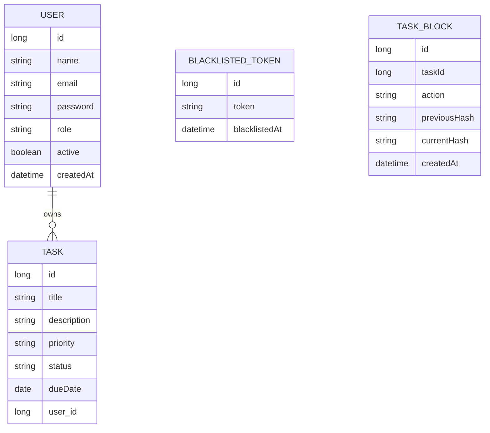

### Entities

| Entity | Fields |
| --- | --- |
| `User` | `id`, `name`, `email`, `password`, `role`, `active`, `createdAt` |
| `Task` | `id`, `title`, `description`, `priority`, `status`, `dueDate`, `user` |
| `BlacklistedToken` | `id`, `token`, `blacklistedAt` |
| `TaskBlock` | `id`, `taskId`, `action`, `previousHash`, `currentHash`, `createdAt` |

## Database Schema

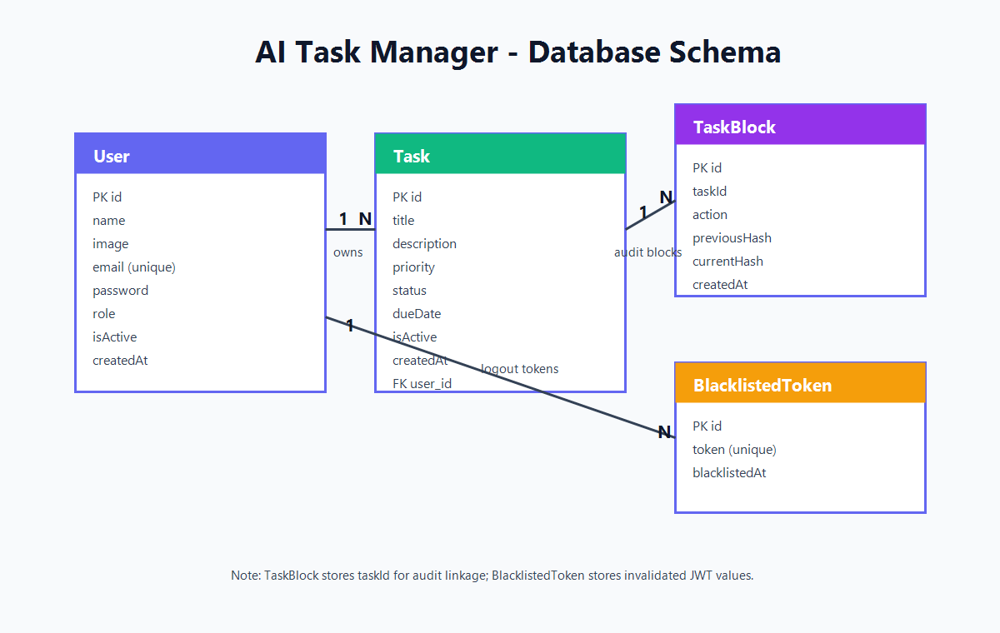

## Setup Instructions

### Prerequisites

- Java 21
- Maven
- MySQL
- OpenRouter API key or OpenAI-compatible API key
- Node.js and npm for the frontend

### 1. Clone Repository

```bash
git clone <repository-url>
cd ai-task-manager
```

### 2. Create Database

```sql
CREATE DATABASE aitask;
```

### 3. Configure Backend

Update `ai-task-manager/src/main/resources/application.properties` or provide environment variables:

```properties
spring.datasource.url=jdbc:mysql://localhost:3306/aitask
spring.datasource.username=root
spring.datasource.password=your_password

spring.jpa.hibernate.ddl-auto=update

spring.ai.openai.api-key=YOUR_OPENROUTER_API_KEY
spring.ai.openai.base-url=https://openrouter.ai/api/v1
spring.ai.openai.chat.options.model=openai/gpt-4o-mini
```

Recommended environment variable approach:

```bash
SPRING_DATASOURCE_URL=jdbc:mysql://localhost:3306/aitask
SPRING_DATASOURCE_USERNAME=root
SPRING_DATASOURCE_PASSWORD=your_password
SPRING_AI_OPENAI_API_KEY=YOUR_OPENROUTER_API_KEY
```

### 4. Build Backend

```bash
cd ai-task-manager
mvn clean install
```

### 5. Run Backend

```bash
mvn spring-boot:run
```

Backend runs at:

```text
http://localhost:8080
```

### 6. Run Frontend

```bash
cd ../ai-task-manager-front
npm install
npm run dev
```

Frontend runs at:

```text
http://localhost:5173
```

### 7. Swagger Documentation

```text
http://localhost:8080/swagger-ui/index.html
```

## API Endpoints

### Authentication APIs

| Method | Endpoint | Description |
| --- | --- | --- |
| `POST` | `/api/auth/register` | Register a new user |
| `POST` | `/api/auth/login` | Authenticate user and return JWT |
| `POST` | `/api/auth/logout` | Logout user and blacklist token |

### Task APIs

| Method | Endpoint | Description |
| --- | --- | --- |
| `POST` | `/api/tasks` | Create task |
| `GET` | `/api/tasks/email/{email}` | Get all tasks by user email |
| `GET` | `/api/tasks/{id}/email/{email}` | Get task by ID and user email |
| `PUT` | `/api/tasks/{id}` | Update task |
| `PATCH` | `/api/tasks/{id}/status/{status}/email/{email}` | Update task status |
| `DELETE` | `/api/tasks/id/{id}/email/{email}` | Delete task |
| `GET` | `/api/tasks/dashboard/{email}` | Get dashboard statistics |

### User APIs

| Method | Endpoint | Description |
| --- | --- | --- |
| `GET` | `/api/users/profile/{email}` | Get user profile |
| `PUT` | `/api/users/profile/{email}` | Update user profile |
| `PUT` | `/api/users/change-password/{email}` | Change password |
| `DELETE` | `/api/users/{email}` | Delete user account |

### AI APIs

| Method | Endpoint | Description |
| --- | --- | --- |
| `POST` | `/api/ai/generate-task-details` | Generate task description, priority, and effort |
| `GET` | `/api/ai/summary/{email}` | Generate productivity summary |
| `GET` | `/api/ai/suggestions/{email}` | Generate smart task suggestions |

### Admin APIs

| Method | Endpoint | Description |
| --- | --- | --- |
| `GET` | `/api/admin/stats` | Get admin statistics |
| `GET` | `/api/admin/users` | View all users |
| `GET` | `/api/admin/users/{userId}` | View user details |
| `PATCH` | `/api/admin/users/{userId}/role/{role}` | Manage user role |
| `DELETE` | `/api/admin/users/{userId}` | Delete user |
| `GET` | `/api/admin/tasks` | View all tasks |

### Blockchain Audit APIs

| Method | Endpoint | Description |
| --- | --- | --- |
| `GET` | `/api/admin/audit-trail` | View blockchain-inspired task audit trail |

## Screenshots

### Landing Page

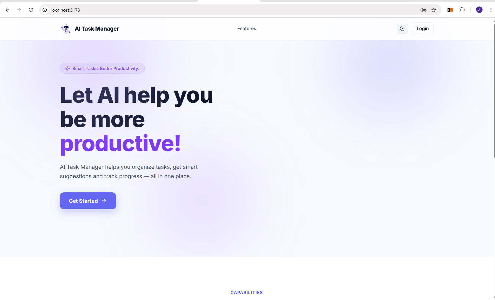

### Login Page

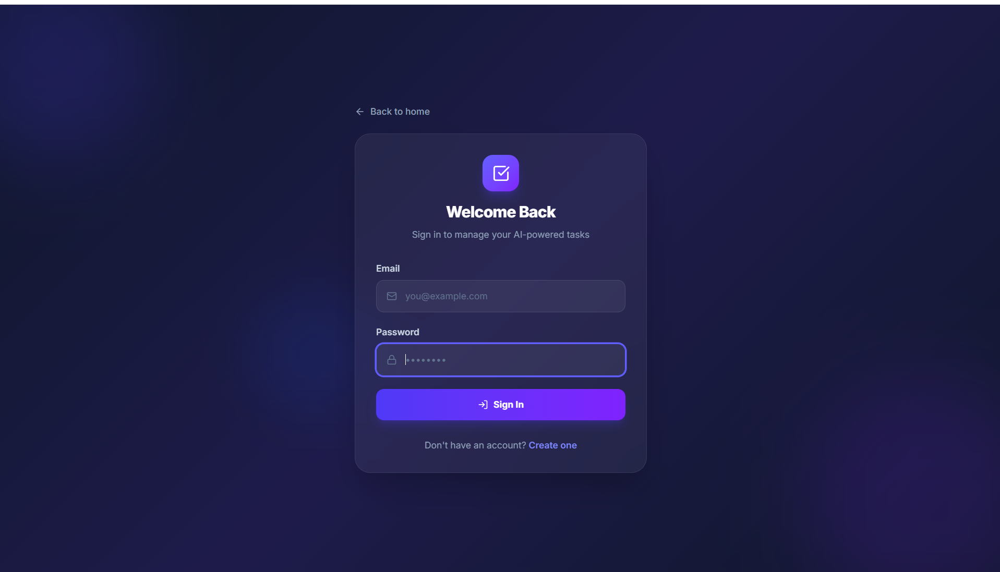

### User Dashboard

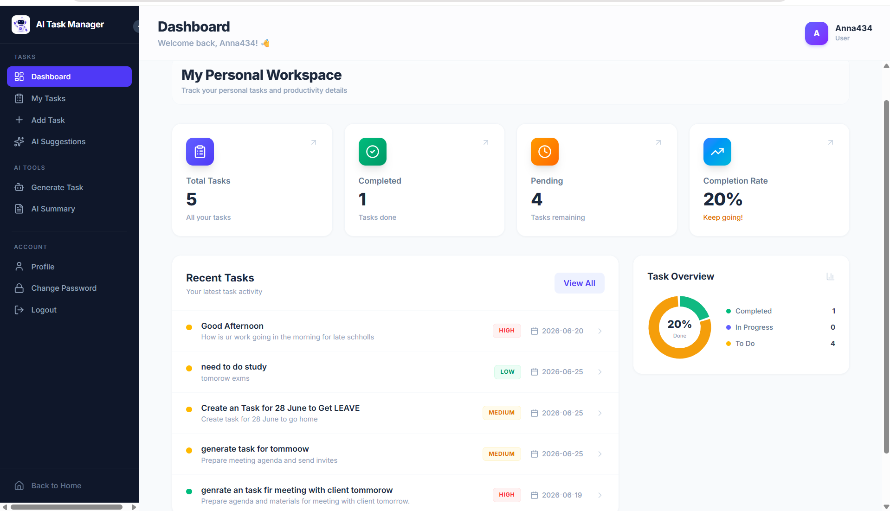

### AI Suggestions

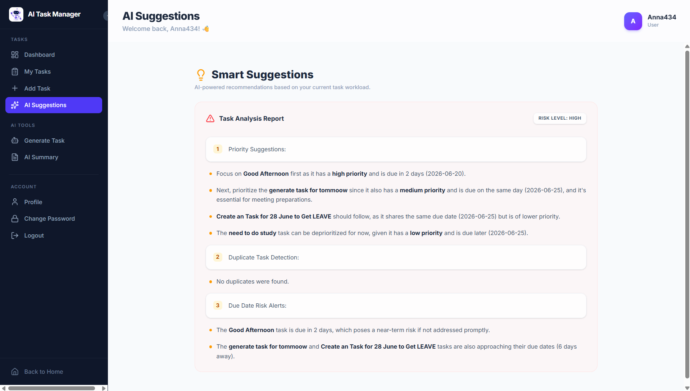

### Admin Statistics Dashboard

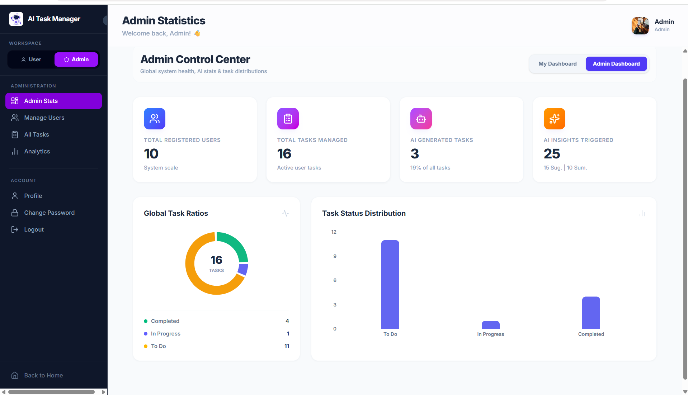

### Manage Users

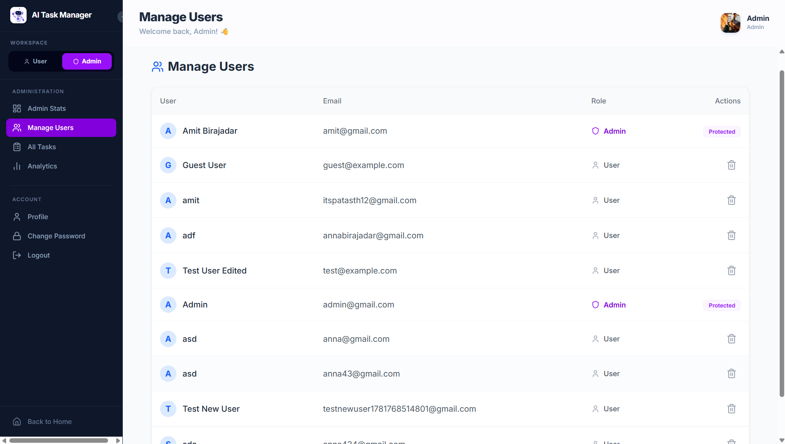

### All Tasks Management

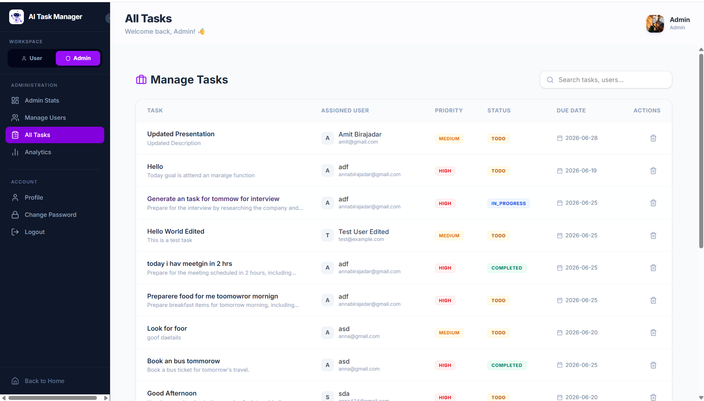

### Analytics Dashboard

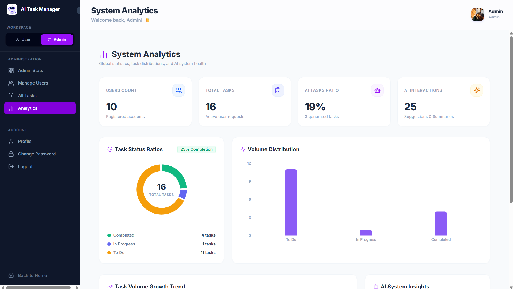

### AI System Insights

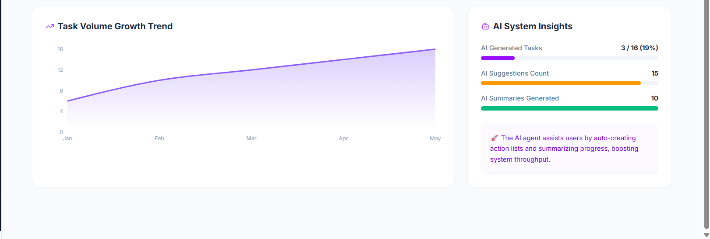

### Blockchain Audit Trail

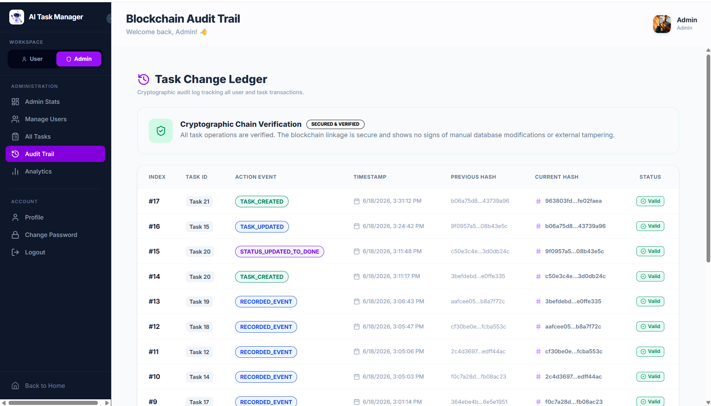

### Audit Trail Table

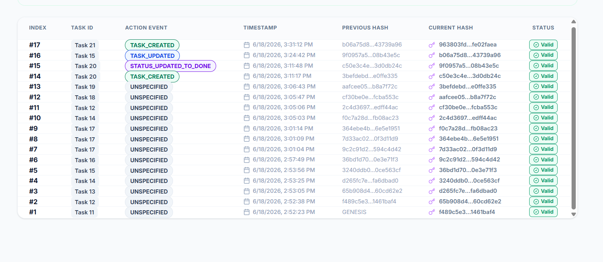

## Future Enhancements

- Email notifications
- Scheduled task reminders
- Real Ethereum blockchain integration
- MetaMask wallet integration
- Mobile application
- Team collaboration
- Real-time notifications
- AI chat assistant

## Author

**Amit Birajadar**

---

<p align="center">
  Built with Java, Spring Boot, Spring AI, MySQL, JWT, and a productivity-first UI.
</p>
